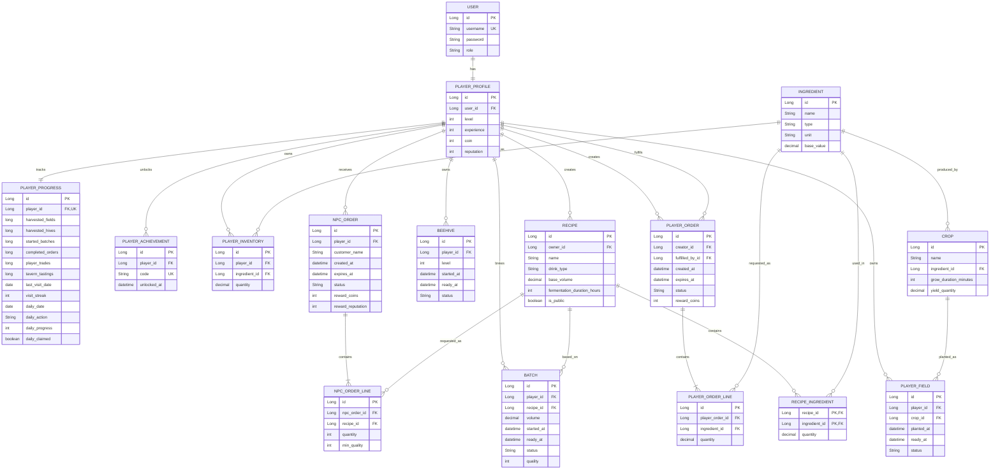

## Remarques

- `RECIPE.owner_id` peut être nul pour les recettes officielles du jeu.
- `PLAYER_INVENTORY` représente une relation joueur–ingrédient avec quantité.
- `RECIPE_INGREDIENT` est une table de liaison enrichie par la quantité.
- `PLAYER_ORDER_LINE` porte les ressources demandées par une commande entre joueurs.
- `PLAYER_ORDER.fulfilled_by_id` reste nul tant que la commande n'a pas été satisfaite.
- `PLAYER_PROGRESS` conserve les compteurs durables, la série de visites et l'objectif quotidien courant.
- L'unicité `(player_id, code)` de `PLAYER_ACHIEVEMENT` garantit qu'une récompense de haut fait n'est attribuée qu'une fois.
- Les temps de production, de fermentation et d'expiration utilisent des timestamps (`LocalDateTime` côté Java).
- Les statuts sont modélisés en Java avec des enums.
- Dans le MVP fonctionnel, le volume restant d'un `BATCH` en statut `READY` sert de stock de boisson finie pour les commandes PNJ.
